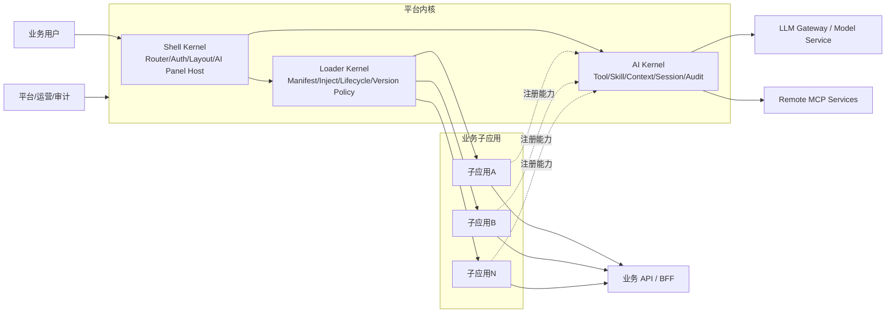
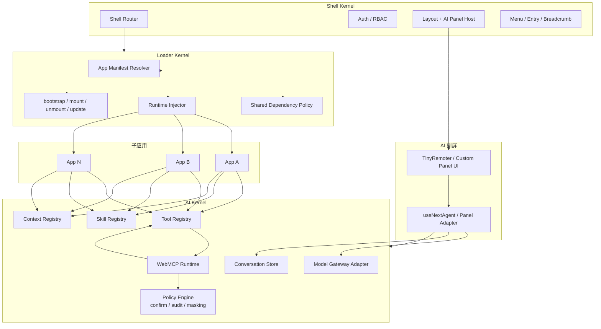
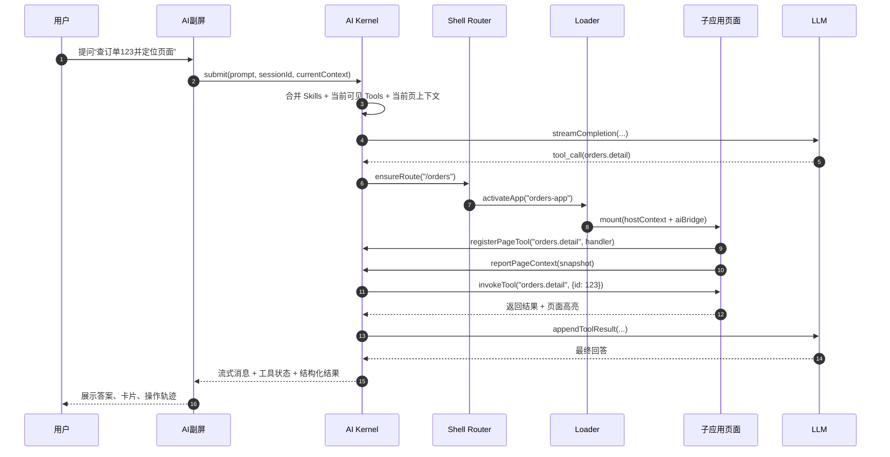
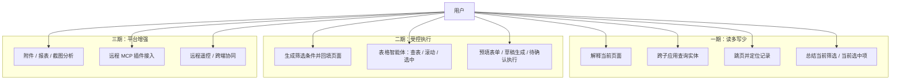

# OpenTiny AI 平台落地架构方案

## 1. 背景与目标

本文档总结前面讨论形成的落地方案，面向如下场景：

- 存量 `Vue3` 微前端项目
- 非 `iframe` 形态，而是共享微组件注册表 + `loader` 异构加载
- 团队负责主应用、平台内核，以及异构版本 `loader`
- 希望在现有业务系统中引入 OpenTiny 的 AI 能力

目标是形成一套可真正落地的平台级方案，而不是单点接一个聊天框。

---

## 2. 核心结论

平台应采用“三个内核 + 一个契约”的模式：

- `Shell Kernel`：主应用壳层，负责路由、权限、布局、AI 副屏挂载
- `Loader Kernel`：负责异构加载、依赖注入、版本策略、生命周期
- `AI Kernel`：负责 WebMCP、Tools、Skills、Context、LLM、审计
- `aiBridge`：对子应用暴露的唯一稳定契约

一句话概括：

> 主应用统一持有 AI 控制面和 `next-sdk` 单例运行时；`loader` 负责装配；子应用只注册能力；AI 副屏只消费能力，不直接耦合子应用。

---

## 3. 上下文视图



---

## 4. 逻辑视图



### 4.1 逻辑关系说明

- 主应用是唯一 AI 入口，负责副屏容器、导航、权限和全局体验。
- `Shell Router` 是平台级路由中枢，不只是前端页面跳转器，还承担“激活哪个子应用”和“给 AI 提供统一导航能力”的职责。
- `Loader` 只负责装配和生命周期，不拥有 AI 状态，也不直接连模型。
- `AI Kernel` 是唯一运行时，负责工具、技能、上下文、模型、会话和审计。
- 子应用是能力提供者，只注册工具、技能和页面上下文，不自己初始化 AI 单例。
- AI 副屏是统一交互面，只通过 `AI Kernel` 消费能力，不直接访问子应用实现。

---

## 5. 运行视图



### 5.1 运行时关键特征

- 同窗体运行，不走 `iframe` 跨窗口桥接。
- 页面工具以子应用页面为边界，在 `mount` 时注册，在 `unmount` 时清理。
- AI 侧永远不直接依赖任意子应用，而是通过 `AI Kernel` 间接调用。
- `ensureRoute()` 是 AI 和微前端导航之间的桥。
- `pageToolsOnDemand` 适合在后续工具数量变多时开启，只暴露当前激活路由相关工具。

---

## 6. 用例视图



---

## 7. 模块关系说明

### 7.1 主应用

主应用是平台唯一 UI 控制面，负责：

- AI 副屏挂载
- 全局导航
- 权限与会话入口
- 统一路由与菜单
- 与 `AI Kernel` 的编排关系

主应用不应该直接承载具体业务工具逻辑。

### 7.2 Loader

`Loader` 是唯一装配层，负责：

- 按 `manifest` 解析并加载子应用
- 注入共享依赖与宿主上下文
- 管理异构版本并存策略
- 统一子应用生命周期

`Loader` 不直接拥有 AI 状态，也不直接与模型交互。

### 7.3 子应用

子应用是能力适配层，负责：

- `registerPageTool()`
- `registerSkills()`
- `reportPageContext()`
- 页内业务 handler

子应用不应该各自初始化一套 AI SDK 单例。

### 7.4 AI 副屏

AI 副屏是统一交互面，负责：

- 多会话
- 流式问答
- 工具调用可视化
- 快捷入口
- 结构化结果展示

AI 副屏不直接访问子应用，而是通过 `AI Kernel` 间接消费能力。

---

## 8. 核心平台契约

| 接口 | 提供方 | 使用方 | 用途 |
|---|---|---|---|
| `mount(hostContext)` | Loader | 子应用 | 注入 `aiBridge/router/auth/storeRefs` |
| `registerPageTool(def)` | AI Kernel | 子应用 | 注册页面工具处理器 |
| `cleanupPageTool()` | AI Kernel | 子应用 | 卸载时反注册工具 |
| `registerSkills(skillSet)` | AI Kernel | 子应用 | 注册领域技能包 |
| `reportPageContext(ctx)` | AI Kernel | 子应用 | 上报当前页上下文 |
| `ensureRoute(route)` | Shell/Loader | AI Kernel | 激活目标子应用和页面 |
| `submitPrompt(prompt, sessionId)` | AI Kernel | AI副屏 | 发起问答和工具调用 |
| `openPanel/closePanel/togglePanel` | Shell | 主应用/子应用 | 控制 AI 副屏 |
| `invokeTool(toolName, args)` | AI Kernel | 内部 | 调度到页面 handler |
| `audit(event)` | Policy Engine | AI Kernel | 记录执行审计 |
| `confirm(action)` | Policy Engine | AI Kernel | 写操作前确认 |

---

## 9. 接口文档草案

以下接口为平台建议的正式契约草案。

### 9.1 Host Context

```ts
export interface HostContext {
  aiBridge: AIBridge
  router: ShellRouter
  auth: AuthContext
  sharedStoreRefs?: Record<string, unknown>
  appInfo: {
    appId: string
    version: string
  }
}
```

### 9.2 Loader 契约

```ts
export interface LoadSubAppRequest {
  appId: string
  version?: string
  route: string
  mountPoint: HTMLElement
  props?: Record<string, unknown>
}

export interface SubAppLifecycle {
  bootstrap?(): Promise<void> | void
  mount(context: HostContext): Promise<void> | void
  update?(context: Partial<HostContext>): Promise<void> | void
  unmount(): Promise<void> | void
}

export interface LoaderKernel {
  loadSubApp(req: LoadSubAppRequest): Promise<SubAppLifecycle>
  activateApp(appId: string, route: string): Promise<void>
  unloadApp(appId: string): Promise<void>
}
```

### 9.3 AI Bridge 契约

```ts
export interface PageToolDef {
  route: string
  namespace: string
  handlers: Record<string, (args: unknown) => Promise<unknown> | unknown>
  meta?: {
    title?: string
    description?: string
    tags?: string[]
  }
}

export interface SkillReference {
  path: string
  content: string
}

export interface SkillSet {
  name: string
  description: string
  skillMarkdown: string
  references?: SkillReference[]
}

export interface PageContextSnapshot {
  route: string
  pageTitle?: string
  entityType?: string
  entityId?: string | number
  selection?: unknown[]
  filters?: Record<string, unknown>
  metadata?: Record<string, unknown>
}

export interface AIBridge {
  registerPageTool(def: PageToolDef): () => void
  registerSkills(skillSet: SkillSet): () => void
  reportPageContext(snapshot: PageContextSnapshot | (() => PageContextSnapshot)): () => void
  ensureRoute(route: string): Promise<void>
  openPanel(payload?: { prompt?: string; route?: string; entityId?: string | number }): void
  closePanel(): void
  togglePanel(): void
}
```

### 9.4 Shell Router 契约

```ts
export interface ShellRouter {
  currentRoute(): string
  navigate(route: string): Promise<void> | void
  ensureRoute(route: string): Promise<void>
}
```

### 9.5 Audit / Confirm 契约

```ts
export interface AuditEvent {
  userId: string
  appId: string
  route: string
  action: string
  toolName?: string
  args?: unknown
  result?: unknown
  status: 'success' | 'error' | 'cancelled'
  timestamp: number
}

export interface ConfirmAction {
  type: 'write' | 'submit' | 'delete' | 'approve'
  title: string
  summary: string
  payload?: unknown
}

export interface PolicyEngine {
  audit(event: AuditEvent): Promise<void>
  confirm(action: ConfirmAction): Promise<boolean>
}
```

---

## 10. 依赖与版本治理

### 10.1 必须单例

以下能力必须主应用平台单例化：

- `@company/ai-bridge-runtime`
- `@opentiny/next-sdk` 的平台运行时实例
- Tool Registry
- Skill Registry
- Context Registry
- Conversation Store
- Policy Engine
- Model Gateway Adapter

### 10.2 允许多版本

以下部分允许在子应用中按版本并存：

- 业务微组件
- 子应用内部 UI 依赖
- 非 AI 的业务 SDK

### 10.3 重要规则

- 子应用不要直接依赖平台内部 AI SDK 实现，只依赖稳定契约。
- 工具名必须带命名空间，例如 `orders.list.query`。
- 子应用必须在 `mount` 注册工具，在 `unmount` 反注册。
- 写操作默认后置到二期，并由策略引擎强制确认。

---

## 11. 分期落地计划

## 第 0 期：平台基线

### 目标

先把“能否稳定装配”做实。

### 要做的事

- 定义 `aiBridge` TypeScript 契约
- 在 `loader` 中加入 AI 运行时单例规则
- 明确共享依赖策略
- 建立一个最小平台 demo
- 统一工具命名、技能目录、审计事件规范

### 交付物

- `aiBridge-types`
- `aiBridge-runtime`
- loader 注入协议
- 依赖治理白名单
- 工具和技能命名规范

### 验收标准

- 主应用和子应用只存在一份 AI Runtime
- 子应用 `mount/unmount` 时工具能正确注册/清理
- 不同版本业务微组件共存时，AI 功能不串状态

### 责任

- 平台团队：主责
- Loader 团队：主责
- 主应用团队：配合

---

## 第 1 期：读多写少 MVP

### 目标

先把“能看懂、能查询、能导航”做出来。

### 要做的事

- 主应用挂载统一 AI 副屏
- AI Kernel 接入 `TinyRemoter` 或 `useNextAgent`
- 接入本地 WebMCP Runtime
- 选择 2 个高价值子应用做试点
- 每个试点子应用接入：
  - `registerPageTool`
  - `registerSkills`
  - `reportPageContext`
- 实现 6 到 10 个只读工具
- 接入会话历史和基本日志
- 开启 `pageToolsOnDemand`

### 交付物

- 单例 AI 副屏
- 试点子应用能力接入
- Skills 文档样板
- Tool Registry 面板
- 会话存储

### 验收标准

- 用户能从副屏跨两个子应用查询并定位数据
- 当前路由只暴露当前子应用相关工具
- 页面卸载后工具自动失效
- 95% 的问答流程不需要人工刷新页面

### 责任

- 主应用团队：副屏、入口、路由
- 平台团队：AI Kernel、Tool/Skill/Context Registry
- Loader 团队：注入与生命周期
- 业务团队：试点工具和技能

---

## 第 2 期：受控执行

### 目标

把 AI 从“查询助手”升级成“受控执行助手”。

### 要做的事

- 增加写操作分类
- 引入确认策略
- 接 RBAC 和审计日志
- 对接结构化结果回填：
  - Grid
  - QueryBuilder
  - FilterBar
  - Drawer/Form
- 引入表格智能体试点
- 支持工具调用可视化
- 建立幂等和失败回滚策略

### 交付物

- Policy Engine
- Confirm Dialog 规范
- 审计中心
- 结构化回填适配器
- 表格智能体试点页面

### 验收标准

- 高风险写操作默认不能无确认执行
- 每次工具执行都能追踪到用户、时间、参数、结果
- 自然语言筛选能回填到至少一个表格场景
- 一条跨子应用流程能跑通

### 责任

- 平台团队：策略、审计、工具编排
- 主应用团队：确认 UI、回填展示
- Loader 团队：上下文透传
- 业务团队：执行类 handler

---

## 第 3 期：平台化扩展

### 目标

从“可用”升级到“可运营、可扩展”。

### 要做的事

- 接远程 MCP 服务
- 引入插件市场和插件治理
- 增加附件、截图、报表分析
- 增加多模型路由和灰度策略
- 增加监控指标
- 增加 A/B 测试和灰度
- 建立 Skills 和 Tools 的平台资产库

### 交付物

- MCP 插件治理中心
- 监控大盘
- 模型路由策略
- 平台资产目录

### 验收标准

- 新子应用可按模板在 1 到 2 天内接入
- 远程 MCP 接入具备权限、配额、审计
- 平台能看到 AI 使用与执行效果

### 责任

- 平台团队：主责
- 主应用团队：展示和运营能力
- Loader 团队：远程插件装配
- 业务团队：持续扩展业务能力

---

## 第 4 期：跨端与智能增强

### 目标

做增强能力，不抢一期二期资源。

### 要做的事

- 手机远控
- 跨端协同
- 更复杂的多模态
- 生成式 UI 灰度
- 更高级的流程编排

### 说明

这一期只在前三期稳定后推进。

---

## 12. 建议的时间节奏

- 第 0 期：2 周
- 第 1 期：4 到 6 周
- 第 2 期：4 到 8 周
- 第 3 期：6 到 8 周
- 第 4 期：按业务机会推进

---

## 13. 最推荐立刻开始的 5 件事

1. 定义 `aiBridge` 契约
2. 在 `loader` 中锁定 AI Runtime 单例策略
3. 主应用先挂统一 AI 副屏
4. 选两个子应用做只读工具试点
5. 建立 Skills 和工具命名规范

